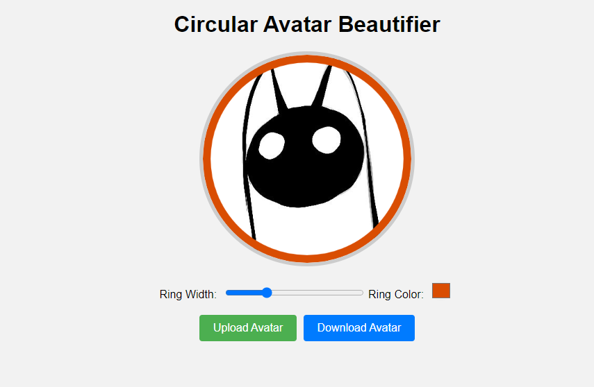

# Circular Avatar Beautifier

Circular Avatar Beautifier is a straightforward web tool for enhancing circular avatars. Upload your avatar image, and it'll be cropped into a circle. You can adjust the ring's width and color for a customized look. Then, download your beautified avatar.

## How to Use

1. **Get Started:** Clone or download this repository.

2. **Open the App:** Launch index.html in your web browser.

3. **Upload Avatar:** Click "Upload Avatar" and choose your image.

4. **Customize:** Adjust ring width or color.

5. **Download:** Click "Download Avatar" to save your enhanced avatar.

For the latest demo, check the "About" or "Deployments" section of this repository.
